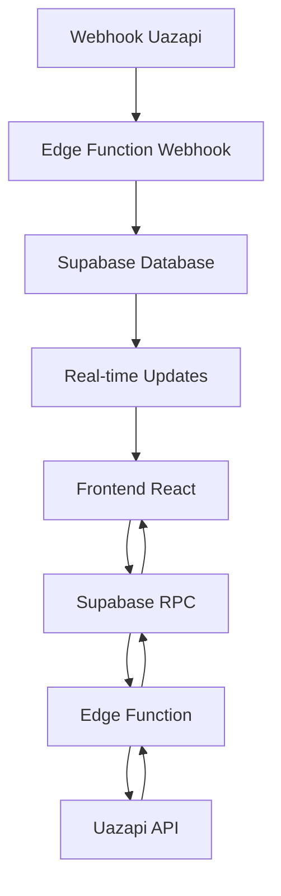

# 🏗️ **ARQUITETURA WHATSAPP LIFE - ANTI-CORS**

## 🎯 **VISÃO GERAL**

Sistema **completamente isolado** para gerenciar instâncias WhatsApp via Uazapi, implementando arquitetura **anti-CORS** para máxima segurança.

---

## 🔄 **FLUXO DE DADOS (ANTI-CORS)**



### **🔒 PRINCÍPIOS DE SEGURANÇA:**
- ✅ **Frontend nunca chama APIs externas**
- ✅ **Credenciais apenas no servidor**
- ✅ **Sem problemas de CORS**
- ✅ **Isolamento total do sistema existente**

---

## 📊 **ESTRUTURA DE COMPONENTES**

### **🗄️ BANCO DE DADOS (ISOLADO)**
```sql
-- Tabela principal (isolada)
whatsapp_life_instances
├── id (UUID, PK)
├── company_id (FK → companies)
├── instance_name (VARCHAR)
├── phone_number (VARCHAR)
├── profile_name (VARCHAR)
├── status (ENUM)
├── provider_instance_id (VARCHAR)
├── provider_token (TEXT, encrypted)
└── timestamps

-- RPC Functions (isoladas)
├── check_whatsapp_life_plan_limit()
├── create_whatsapp_life_instance_rpc()
├── get_whatsapp_life_qrcode_rpc()
├── update_whatsapp_life_instance_status()
└── delete_whatsapp_life_instance()
```

### **⚡ EDGE FUNCTIONS (SERVIDOR ISOLADO)**
```typescript
supabase/functions/
├── whatsapp-life-create-instance/
│   ├── index.ts                    // Criar instância Uazapi
│   └── Credenciais protegidas
├── whatsapp-life-get-qrcode/
│   ├── index.ts                    // Obter QR Code
│   └── Timeout e retry automático
└── whatsapp-life-webhook/          // Futuro
    ├── index.ts                    // Receber webhooks
    └── Processamento isolado
```

### **🎨 FRONTEND (ISOLADO)**
```typescript
src/
├── components/WhatsAppLife/
│   ├── WhatsAppLifeModule.tsx      // Componente principal
│   └── index.ts                    // Exports
├── hooks/
│   ├── useWhatsAppInstances.ts     // Gerenciar instâncias
│   ├── usePlanLimits.ts            // Limites do plano
│   └── useQRCode.ts                // QR Code management
├── pages/settings/
│   └── whatsapp-life.tsx           // Página isolada
└── types/
    └── whatsapp-life.ts            // Tipos específicos
```

---

## 🔐 **SEGURANÇA E ISOLAMENTO**

### **🛡️ ISOLAMENTO GARANTIDO**
```
✅ Prefixos únicos: whatsapp_life_*
✅ Namespace isolado: WhatsAppLife
✅ RLS por empresa: Cada empresa vê apenas suas instâncias
✅ Validações: Limites de plano automáticos
✅ Credenciais: Apenas no servidor (Edge Functions)
```

### **🔒 PROTEÇÃO DE DADOS**
```typescript
// ✅ CORRETO: Credenciais no servidor
const UAZAPI_CONFIG = {
  BASE_URL: Deno.env.get('UAZAPI_BASE_URL'),
  ADMIN_TOKEN: Deno.env.get('UAZAPI_ADMIN_TOKEN'), // Nunca exposto
};

// ✅ CORRETO: Frontend usa apenas RPC
const { data, error } = await supabase.rpc('create_whatsapp_life_instance_rpc', {
  p_company_id: companyId,
  p_instance_name: name,
});
```

---

## 📋 **LIMITES POR PLANO**

### **💰 CONFIGURAÇÃO DE PLANOS**
```typescript
const PLAN_LIMITS = {
  basic: { maxInstances: 1, price: 'Gratuito' },
  start: { maxInstances: 3, price: 'R$ 97/mês' },
  professional: { maxInstances: 10, price: 'R$ 297/mês' },
  enterprise: { maxInstances: 50, price: 'R$ 897/mês' }
};
```

### **🔍 VALIDAÇÃO AUTOMÁTICA**
```sql
-- Verificação automática antes de criar instância
SELECT check_whatsapp_life_plan_limit('company-uuid');
-- Retorna: { canAdd: boolean, currentCount: number, maxAllowed: number }
```

---

## 🚀 **FLUXOS PRINCIPAIS**

### **1. CRIAR INSTÂNCIA**
```
1. Frontend → RPC create_whatsapp_life_instance_rpc()
2. RPC → Edge Function whatsapp-life-create-instance
3. Edge Function → Verificar limites no banco
4. Edge Function → Criar instância no Uazapi
5. Edge Function → Salvar dados no banco
6. Retorno → Frontend (sucesso/erro)
```

### **2. OBTER QR CODE**
```
1. Frontend → RPC get_whatsapp_life_qrcode_rpc()
2. RPC → Edge Function whatsapp-life-get-qrcode
3. Edge Function → Buscar instância no banco
4. Edge Function → Solicitar QR Code do Uazapi
5. Edge Function → Atualizar QR Code no banco
6. Retorno → Frontend (QR Code base64)
```

### **3. MONITORAMENTO (FUTURO)**
```
1. Uazapi → Webhook → Edge Function whatsapp-life-webhook
2. Edge Function → Processar evento
3. Edge Function → Atualizar status no banco
4. Banco → Real-time → Frontend (atualização automática)
```

---

## 📊 **ESTADOS DA INSTÂNCIA**

### **🔄 CICLO DE VIDA**
```typescript
type InstanceStatus = 
  | 'disconnected'   // Criada, sem conexão
  | 'connecting'     // Criando no Uazapi
  | 'qr_pending'     // Aguardando scan QR Code
  | 'connected'      // Conectada e funcionando
  | 'error';         // Erro na conexão

// Transições automáticas via webhooks (futuro)
```

---

## 🧪 **TESTES E VALIDAÇÃO**

### **✅ TESTES DE ISOLAMENTO**
```bash
# 1. Sistema existente funciona normalmente
curl https://lovoo-dev.vercel.app/dashboard

# 2. WhatsApp Life carrega isoladamente
curl https://lovoo-dev.vercel.app/settings/whatsapp-life

# 3. RPC functions respondem
# (Testar no Supabase SQL Editor)
SELECT check_whatsapp_life_plan_limit('company-uuid');
```

### **🔍 MONITORAMENTO**
```sql
-- Verificar instâncias por empresa
SELECT company_id, COUNT(*) as instances
FROM whatsapp_life_instances 
GROUP BY company_id;

-- Verificar status das instâncias
SELECT status, COUNT(*) as count
FROM whatsapp_life_instances 
GROUP BY status;
```

---

## 📈 **ROADMAP FUTURO**

### **FASE 1: MVP (ATUAL)**
- ✅ Criar instâncias Uazapi
- ✅ Obter QR Code
- ✅ Interface básica
- ✅ Limites por plano

### **FASE 2: CHAT BÁSICO**
- 🔄 Webhook para receber mensagens
- 🔄 Interface de chat
- 🔄 Integração com leads

### **FASE 3: RECURSOS AVANÇADOS**
- 🔄 Mensagens interativas
- 🔄 Agendamento de mensagens
- 🔄 Automações básicas
- 🔄 Relatórios e métricas

---

## 🛡️ **GARANTIAS DE SEGURANÇA**

### **❌ NUNCA SERÁ AFETADO:**
- Sistema de leads existente
- Páginas e funcionalidades atuais
- Banco de dados existente
- Configurações de produção
- Autenticação e usuários

### **✅ SEMPRE ISOLADO:**
- Tabelas com prefixo específico
- RPC functions com namespace próprio
- Componentes em pasta isolada
- Edge functions dedicadas
- Credenciais protegidas no servidor

**ARQUITETURA 100% SEGURA E ISOLADA!**
